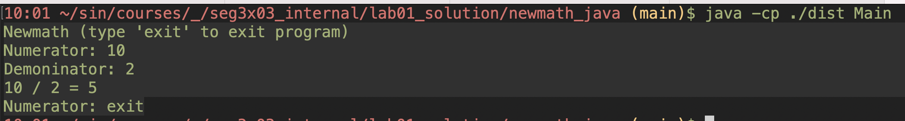
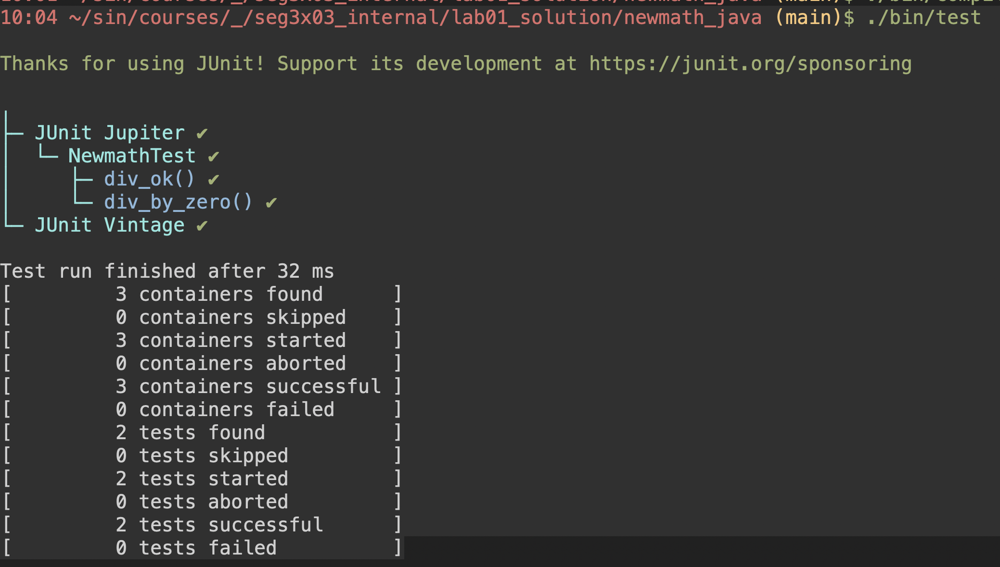
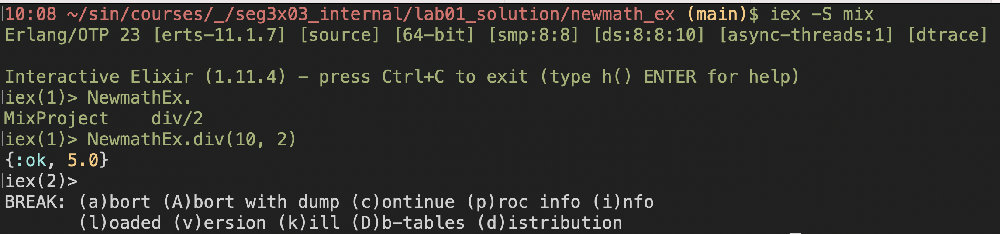
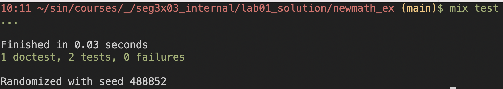

# Lab 01

| Outline | Value |
| --- | --- |
| Course | SEG 3X03 |
| Date | Summer 2021 |
| Professor | Andrew Forward, aforward@uottawa.ca |
| TA | James Url, jamesurl@uottawa.ca |
| Team | Andrew Forward 1484511<br>Ayana Forward 9021000 |

## Deliverables

* [https://github.com/aforward/seg3103_playground/tree/main/lab01](https://github.com/aforward/seg3103_playground/tree/main/lab01)
* Shared repo above with TA and Professors

### Java

I am running Java openjdk 16

```bash
$ java --version
openjdk 16 2021-03-16
OpenJDK Runtime Environment (build 16+14)
OpenJDK 64-Bit Server VM (build 16+14, mixed mode)
```

To run the Java program (in `newmath_java`), first I compile it

```bash
javac -encoding UTF-8 --source-path src -d dist src/*.java
```

Then I run it

```bash
java -cp ./dist Main
```

Here is an output of the running program

```bash
Newmath (type 'exit' to exit program)
Numerator: 10
Demoninator: 2
10 / 2 = 5
Numerator: exit
```

With a screenshot from the terminal




### JUnit

I am working with JUnit 5 (via Console standalone 1.7.1)

To run JUnit, I need to compile the application (see above), and then compile the test code

```bash
javac -encoding UTF-8 --source-path test -d dist -cp dist:lib/junit-platform-console-standalone-1.7.1.jar test/*.java
```

Then I run the tests using

```
java -jar lib/junit-platform-console-standalone-1.7.1.jar --class-path dist --scan-class-path
```

Here is the output of the tests

```bash
Thanks for using JUnit! Support its development at https://junit.org/sponsoring

╷
├─ JUnit Jupiter ✔
│  └─ NewmathTest ✔
│     ├─ div_ok() ✔
│     └─ div_by_zero() ✔
└─ JUnit Vintage ✔

Test run finished after 32 ms
[         3 containers found      ]
[         0 containers skipped    ]
[         3 containers started    ]
[         0 containers aborted    ]
[         3 containers successful ]
[         0 containers failed     ]
[         2 tests found           ]
[         0 tests skipped         ]
[         2 tests started         ]
[         0 tests aborted         ]
[         2 tests successful      ]
[         0 tests failed          ]
```

With a screenshot from the terminal




### Elixir

I am running Elixir 11.4 with Erlang 23

```bash
$ elixir --version
Erlang/OTP 23 [erts-11.1.7] [source] [64-bit] [smp:8:8] [ds:8:8:10] [async-threads:1] [dtrace]

Elixir 1.11.4 (compiled with Erlang/OTP 23)
```

To run the Elixir program (in `newmath_ex`), first I compile it

```bash
mix compile
```

Then I run it

```bash
iex -S mix
```

Here is an output of the running program

```elixir
iex(1)> NewmathEx.
MixProject    div/2
iex(1)> NewmathEx.div(10, 2)
{:ok, 5.0}
```

With a screenshot from the terminal



### ExUnit

ExUnit is built directly into Elixir (and compiled like above with `mix compile`)

To run the tests

```
mix test
```

Here is the output of the tests

```bash
Compiling 1 file (.ex)
...

Finished in 0.02 seconds
1 doctest, 2 tests, 0 failures

Randomized with seed 975082
```

With a screenshot from the terminal



